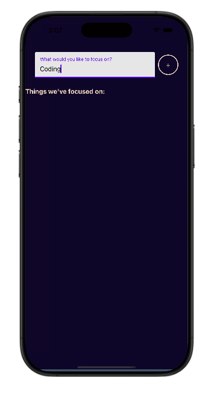
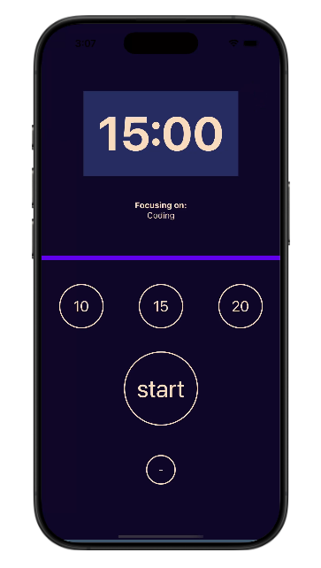

## ⏳ Focus Time App
Focus Time is a simple yet efficient productivity app built using React Native. It helps users stay focused by setting a timer for deep work or study sessions. Once the timer runs out, the app triggers a vibration alert to notify the user that the focus session has ended.
[Focus Time App - Demo on Expo Snack](https://snack.expo.dev/@bibekyogi6462/focustime_project)

